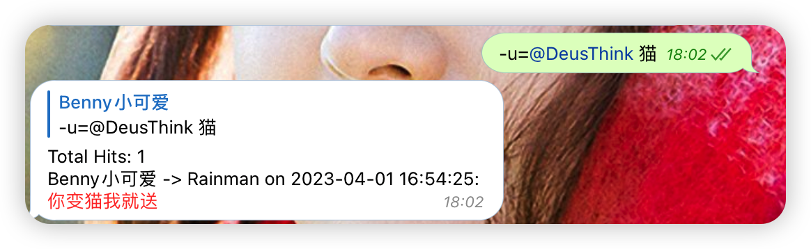

# SearchGram

A telegram Bot that can search for CJK and other languages, as well as message backup utility.

# Introduction

Telegram has bad search experience for CJK languages because those languages are not separated by spacing.

Bug issues were submitted years ago but never fixed.

* https://github.com/tdlib/td/issues/1004
* https://bugs.telegram.org/c/724

I'm not planning to be sitting ducks, so I create a bot that can search for CJK languages.

# Feature

* support text message
* support caption inside photo and document
* support chat username hints
* support import user supplied chat history
* support seamless sync specified chat history in background
* search for one specific user: `/user <username>|<id>|<firstname> keyword`

# Theory

1. Telegram allows multiple sessions, maximum is 10 clients.
2. We create a hidden session
3. We use this session to store all your incoming and outgoing text messages to MongoDB
4. We create another bot to search MongoDB
5. We return the whole sentence, so you could use Telegram's built-in buggy search feature.

What about history chats before running this bot?

Don't worry, we can either import your history chats, or use config file to sync your history chats.

# Screenshots




https://user-images.githubusercontent.com/14024832/164222317-ea6b228c-bda3-4983-afd7-7bc8f6af5409.mp4

# Installation

**Because chat history is very important, and it should be kept privately, so I don't offer any public bots.**

**For how to use it in docker, please refer to [Docker.md](Docker.md)**

## 1. Preparation

* Download or clone this repository
* Install Python from here: https://www.python.org/downloads/
* Install MongoDB from here: https://www.mongodb.com/download/
* Apply for APP_ID and APP_HASH from here: https://my.telegram.org/
* Talk to https://t.me/BotFather to get your bot token
* Talk to https://t.me/blog_update_bot to get your user id and your bot's id

## 2. Modify environment file

Use your favorite editor to modify `config.py`, example:

```python
APP_ID = 176552
APP_HASH = "667276jkajhw"
TOKEN = "123456:8hjhad"
MONGO_HOST = "localhost"
OWNER_ID = "2311231"
```

If your network is limited(like in China), you need to setup proxy:

```python
PROXY = {"scheme": "socks5", "hostname": "localhost", "port": 1080}
```

## 3. Login to client

Open a terminal(cmd, iTerm, etc), change directory to your code, and then:

```shell
python client.py
```

Input your phone number and login to the client. Ctrl + C to exit

## 4. (optional)Setup sync id

See [here](Docker.md#6-optionalsetup-sync-id)

## 5. Run!

Open two terminals, and respectively:

```shell
python client.py
python bot.py
```

# Roadmap and TODOs

- [x] chat history
- [ ] jieba

# License

This project is LICENSED under the GNU GENERAL PUBLIC LICENSE Version 3.
