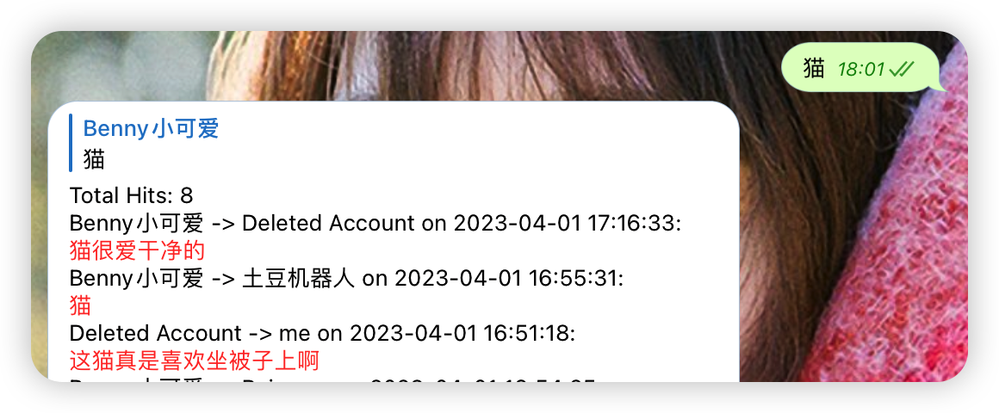
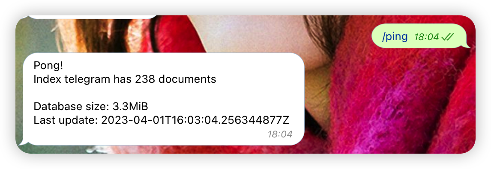
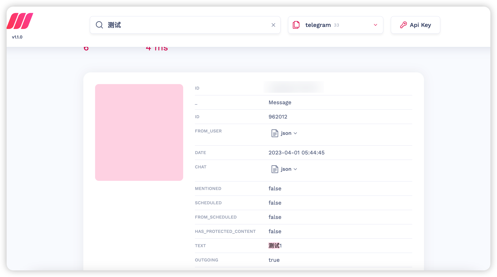

# SearchGram

SearchGram is a Telegram bot that improves search experience for Chinese, Japanese, and Korean (CJK) languages and
provides message backup functionality.

# Introduction

Telegram's search function has poor support for CJK languages because there are no spaces to separate words.

Issues regarding this have been reported years ago but have yet to be resolved.

* https://github.com/tdlib/td/issues/1004
* https://bugs.telegram.org/c/724

# Feature

* Supports text message search
* Provides typo-tolerant and fuzzy search for CJK languages
* Supports filters for GROUP, CHANNEL, PRIVATE, SUPERGROUP, and BOT
* Supports username/ID filtering
* Supports caption search for photos and documents
* Supports seamless chat history sync in the background
* Provides pagination
* Uses a WebUI for searching

# search syntax

1. global search: send any message to the bot
2. chat type search: `-t=GROUP keyword`, support types are ["BOT", "CHANNEL", "GROUP", "PRIVATE", "SUPERGROUP"]
3. chat user search: `-u=user_id|username keyword`
4. exact match: `-m=e keyword` or directly `"keyword"`
5. combine of above: `-t=GROUP -u=user_id|username keyword`
6. `/private [username] keyword`: search in private chat with username, if username is omitted, search in all private
   chats. This also applies to all above search types.\n

# commands

```shell
/start - Start the bot
/ping - Check if the bot is alive
/help - Show help message and search syntax
/delete - Delete all messages from specific chat
/bot - Search messages from bots
/channel - Search messages from channels
/group - Search messages from groups
/private - Search messages from private chats
/supergroup - Search messages from supergroups
```

# Theory

SearchGram works by:

1. Allowing multiple sessions, with a maximum of 10 clients.
2. Creating a hidden session to store all incoming and outgoing text messages to MeiliSearch.
3. Creating another bot to query MeiliSearch.
4. Returning the whole sentence to use Telegram's built-in search feature, which is known to be buggy.

If you're concerned about chat history prior to running the bot,

you can relax because SearchGram offers a solution to sync your chat history using a configuration file.

# Screenshots






# System Requirements

Any system that can run Python 3.8+ and MeiliSearch should be able to run SearchGram.

Better to have bigger ram so MeiliSearch can run faster.

If you have limited RAM, you can set environment variables `MEILI_MAX_INDEXING_MEMORY=800M` to limit the RAM use in
MeiliSearch.

For more information, please
see [Max indexing memory](https://www.meilisearch.com/docs/learn/configuration/instance_options#max-indexing-memory)

# Installation

**Note: Because chat history should be kept private, we do not offer any public bots.**
**To learn how to use SearchGram in Docker, please refer to the [Docker.md](Docker.md)**

Please follow the steps below to install SearchGram:

## 1. Preparation

* Download or clone this repository
* Install Python from here: https://www.python.org/downloads/
* Install MeiliSearch from here: https://github.com/meilisearch/meilisearch
* Apply for APP_ID and APP_HASH from here: https://my.telegram.org/
* Obtain your bot token by contacting https://t.me/BotFather.
* Obtain your user ID by contacting https://t.me/blog_update_bot.

## 2. Modify environment file

Use your favorite editor to modify `config.py`, example:

```python
APP_ID = 176552
APP_HASH = "667276jkajhw"
TOKEN = "123456:8hjhad"
MEILI_HOST = "localhost"
OWNER_ID = "2311231"
```

If you have limited network access, such as in China, you will need to set up a proxy.

```python
PROXY = {"scheme": "socks5", "hostname": "localhost", "port": 1080}
```

## 3. Login to client

Open a terminal (such as cmd or iTerm), navigate to the directory where you have saved the code, and then:

```shell
python client.py
```

Enter your phone number and log in to the client. You can exit by pressing `Ctrl + C`.

## 4. (optional)Setup sync id

See [here](Docker.md#6-optionalsetup-sync-id)

## 5. Run!

Open two terminals and run the following commands in each terminal:

```shell
python client.py
python bot.py
```

## 6. (Optional) Migration

* add timestamp to all your data for better sorting `python add_timestamp.py`

# Sponsor

* [Buy me a coffee](https://www.buymeacoffee.com/bennythink)
* [Afdian](https://afdian.net/@BennyThink)
* [GitHub Sponsor](https://github.com/sponsors/BennyThink)

## Stripe

If you would like to donate to the project using Stripe, please click on the button below.

You can choose the currency and payment method that best suits you.

| USD(Card, Apple Pay and Google Pay)              | SEK(Card, Apple Pay and Google Pay)              | CNY(Card, Apple Pay, Google Pay and Alipay)      |
|--------------------------------------------------|--------------------------------------------------|--------------------------------------------------|
| [USD](https://buy.stripe.com/cN203sdZB98RevC3cd) | [SEK](https://buy.stripe.com/bIYbMa9JletbevCaEE) | [CNY](https://buy.stripe.com/dR67vU4p13Ox73a6oq) |
|                               |                               |                               |

# License

This project is licensed under the GNU GENERAL PUBLIC LICENSE Version 3.
